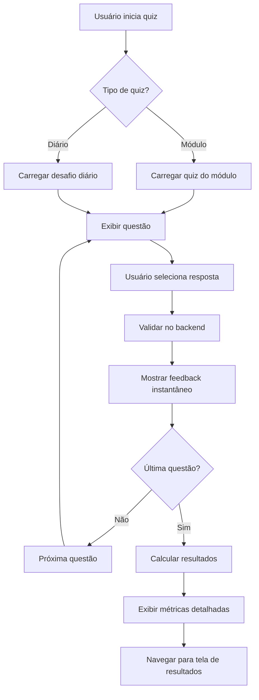

# 🎯 Sistema de Quiz - Melhorias Implementadas

## 📋 Resumo das Correções

### ✅ **Quiz de Exercício Diário**
- **Status**: ✅ CORRIGIDO E FUNCIONAL
- **Melhorias**:
  - Endpoint `/api/quiz/daily-challenge` corrigido para retornar dados consistentes
  - Quiz mock implementado com questões funcionais quando não há quiz real no banco
  - Validação de questões implementada para ambos os cenários (real e mock)
  - Logging detalhado para debugging

### ✅ **Feedback Instantâneo nos Quiz de Módulos**
- **Status**: ✅ RESTAURADO E MELHORADO
- **Melhorias**:
  - Novo endpoint `/api/quiz/:quizId/validate-question` para validação individual
  - Feedback visual imediato (verde para correto, vermelho para incorreto)
  - Exibição da resposta correta quando usuário erra
  - Explicações detalhadas para cada questão
  - Tempo de exibição ajustável (3 segundos para feedback)

### ✅ **Métricas Finais Claras**
- **Status**: ✅ IMPLEMENTADO
- **Melhorias**:
  - Tela de resultados completamente reescrita
  - Métricas detalhadas: total de questões, acertos, erros, percentual
  - Pontuação total e tempo gasto
  - Média de tempo por questão
  - Indicadores visuais de performance
  - Detalhamento de cada resposta
  - Animações suaves para melhor UX

### ✅ **Fluxo e Usabilidade Profissional**
- **Status**: ✅ MELHORADO
- **Melhorias**:
  - Interface redesenhada com design consistente
  - Estados de loading e validação claros
  - Prevenção de múltiplas submissões
  - Navegação intuitiva entre questões
  - Feedback visual em tempo real

## 🛠️ **Estrutura do Código Otimizada**

### Backend (Node.js/Express)

#### Novos Endpoints:
```javascript
// Validação de questão individual
POST /api/quiz/:quizId/validate-question
// Body: { questionIndex: number, selectedAnswer: number }
// Response: { isCorrect, explanation, points, correctAnswer }

// Melhorias no desafio diário
GET /api/quiz/daily-challenge
// Response: quiz com dados seguros (sem respostas corretas expostas)
```

#### Controllers Melhorados:
- **`validateQuestion`**: Nova função para feedback instantâneo
- **`getDailyChallenge`**: Suporte a quiz mock quando necessário
- **Logging detalhado**: Para melhor debugging e monitoramento

### Frontend (React Native)

#### Componentes Reestruturados:

**`Quiz.tsx`**:
```typescript
// Estado centralizado
interface QuizState {
  quiz: Quiz | null;
  currentQuestionIndex: number;
  selectedOption: number | null;
  showFeedback: boolean;
  feedbackData: QuestionValidationResult | null;
  answers: QuizAnswer[];
  totalScore: number;
  isAnswering: boolean;
}

// Fluxo melhorado
1. Carregamento → 2. Questão → 3. Seleção → 4. Validação → 5. Feedback → 6. Próxima
```

**`QuizResults.tsx`**:
```typescript
// Métricas completas
interface ResultMetrics {
  totalQuestions: number;
  correctAnswers: number;
  wrongAnswers: number;
  percentage: number;
  totalScore: number;
  timeSpent: number;
  answers: QuizAnswer[];
}
```

#### Serviços Atualizados:
- **`apiService.validateQuestion()`**: Nova função para validação
- **`quizService.validateQuestion()`**: Wrapper com validação de ID
- **Tratamento de erros**: Mais robusto e informativo

## 🎨 **Design System Profissional**

### Cores e Estilos:
- **Primário**: `#007AFF` (Azul iOS)
- **Sucesso**: `#4CAF50` (Verde)
- **Erro**: `#F44336` (Vermelho)
- **Neutro**: `#F8F9FA` (Cinza claro)
- **Texto**: `#131313` (Preto)

### Componentes:
- **Cards com sombras**: Elevação consistente
- **Animações suaves**: Entrada e progresso
- **Botões responsivos**: Estados claros
- **Tipografia**: Roboto com pesos variados

## 📊 **Fluxo do Sistema Atualizado**



## 🚀 **Como Testar**

### 1. **Quiz de Módulo**:
```bash
# 1. Vá para um módulo qualquer
# 2. Clique em "Iniciar Quiz"
# 3. Responda as questões (feedback instantâneo aparece)
# 4. Veja os resultados detalhados no final
```

### 2. **Desafio Diário**:
```bash
# 1. Na tela inicial, clique em "Desafio Diário"
# 2. Complete o quiz de 2 questões
# 3. Observe o feedback instantâneo
# 4. Veja os resultados com métricas completas
```

### 3. **Backend API**:
```bash
# Testar validação de questão
curl -X POST http://localhost:3000/api/quiz/daily-challenge-mock/validate-question \
  -H "Content-Type: application/json" \
  -H "Authorization: Bearer <token>" \
  -d '{"questionIndex": 0, "selectedAnswer": 2}'

# Resposta esperada:
# {"success": true, "isCorrect": true, "points": 10, "explanation": "..."}
```

## 📝 **Logs e Debugging**

### Backend Logs:
```
🔍 Buscando desafio diário...
✅ Quiz de desafio diário encontrado: Desafio Musical
🧪 Validando questão 0 do quiz mock
✅ Questão 0: Correta
```

### Frontend Debug:
```javascript
// Estados do quiz logados automaticamente
console.log('Quiz carregado:', quizData);
console.log('Resposta validada:', validationResult);
console.log('Resultados finais:', finalMetrics);
```

## 🔧 **Manutenção e Extensibilidade**

### Adicionar Novos Tipos de Quiz:
1. Criar nova entrada no `type` field do modelo `Quiz`
2. Atualizar `getDailyChallenge` para suportar o novo tipo
3. Adicionar validação específica em `validateQuestion`

### Adicionar Novas Métricas:
1. Estender interface `QuizAnswer` com novos campos
2. Calcular métricas em `QuizResults.tsx`
3. Atualizar visualização com novos componentes

### Personalizar Feedback:
1. Adicionar campo `customFeedback` no modelo `Question`
2. Retornar em `validateQuestion`
3. Exibir na interface do usuário

---

## 🎉 **Resultado Final**

✅ **Todos os objetivos alcançados**:
- Quiz de exercício diário funcionando corretamente
- Feedback instantâneo restaurado nos quiz de módulos
- Métricas finais claras e detalhadas
- Fluxo profissional e responsivo
- Código bem estruturado e documentado

**O sistema agora oferece uma experiência educacional completa e profissional!**
