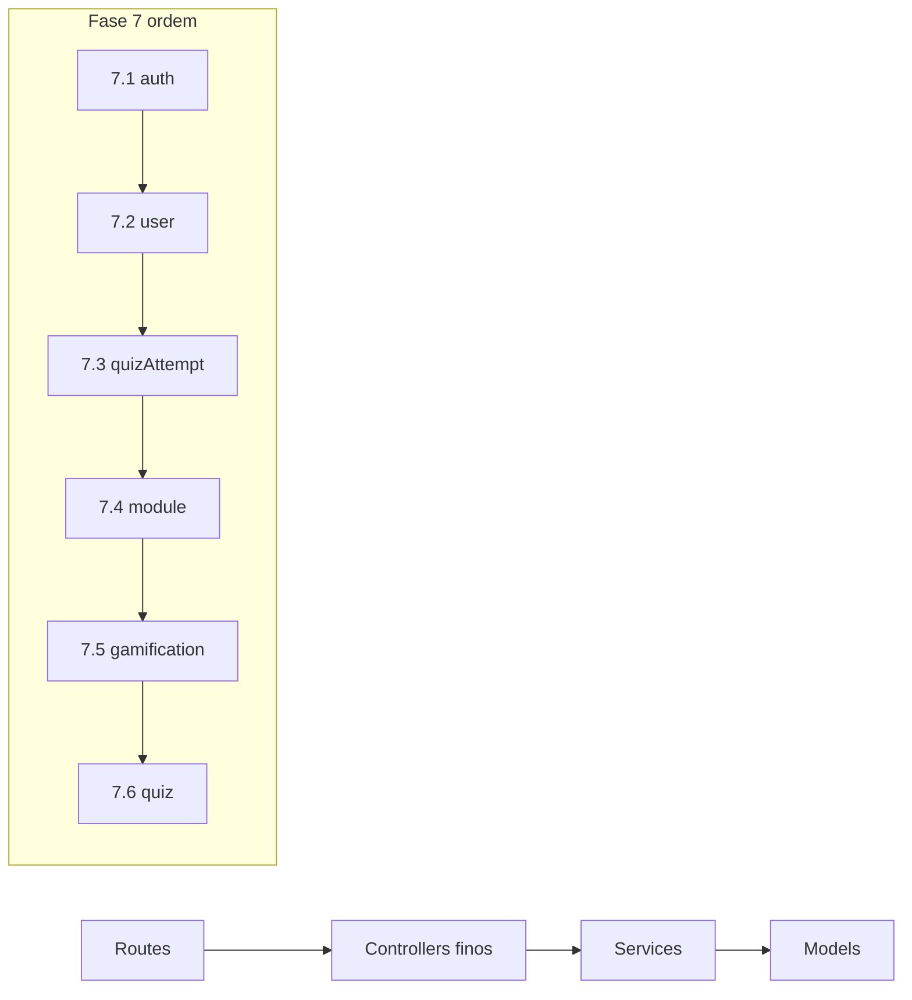

# Fase 7 — Mapa de Extração de Services

> Documento de execução. **Seguir esta listagem na ordem.** Um sub-passo por commit.
>
> **Criado em:** 17/06/2025  
> **Status:** ✅ Concluída (7.1–7.6)  
> **Referência:** [`GUIA_LIMPEZA_ARQUITETURA.md`](GUIA_LIMPEZA_ARQUITETURA.md) — Fase 7

---

## Objetivo

Extrair lógica de negócio dos **fat controllers** para **services**, mantendo:

- Mesmas rotas HTTP (zero breaking change na API)
- Mesmos formatos de resposta JSON
- Controllers finos: `validação → service → res.status().json()`

**Regra de ouro:**

```
routes → controllers (finos) → services → models
```

---

## Estado atual (diagnóstico)

### Tamanho dos controllers

| Controller | Linhas | Exports | Service existente |
|------------|--------|---------|-------------------|
| `quiz.controller.js` | **1292** | 12 | ❌ |
| `gamification.controller.js` | **639** | 8 | ⚠️ parcial (`gamification.service.js`) |
| `module.controller.js` | **588** | 8 | ❌ |
| `auth.controller.js` | **386** | 7 | ❌ |
| `user.controller.js` | **233** | 6 | ❌ |
| `accountDeletion.controller.js` | **185** | 5 | ❌ |
| `quizAttempt.controller.js` | **152** | 5 | ❌ |

### Services hoje

| Arquivo | Situação |
|---------|----------|
| `email.service.js` | ✅ Completo (Fase 6) |
| `gamification.service.js` | ⚠️ Só achievements/challenges/stats básicos; controller ignora parte e reimplementa |

### Dependências cruzadas (cuidado)

| Controller | Depende de |
|------------|------------|
| `auth.controller` | User, JWT, email.service, cache (login) |
| `quiz.controller` | Quiz, User, Module, constants, gamificationRebalanced, dailyChallengeGenerator |
| `module.controller` | Module, User, Quiz, gamificationRebalanced, cache |
| `gamification.controller` | User, Module (lazy require), gamification.service, gamificationRebalanced |
| `accountDeletion.controller` | User, QuizAttempt |

### Frontend — rotas críticas (não quebrar)

| Fluxo | Endpoints |
|-------|-----------|
| Login | `POST /api/auth/login`, `GET /api/auth/me` |
| Módulos | `GET /api/modules`, `GET /api/modules/categories-with-modules` |
| Quiz | `GET /api/quiz/:moduleId`, `POST /api/quiz/:id/validate/:idx`, `POST /api/quiz/:id/submit/private` |
| Desafio diário | `GET /api/quiz/daily-challenge` |
| Gamificação | `GET /api/gamification/stats` |
| Tentativas | `GET /api/quiz-attempts/check/:quizId/:moduleId` |

---

## Arquitetura alvo (após Fase 7)

```
src/services/
├── email.service.js          ✅ já existe
├── auth.service.js           ← JWT, register, login, senha, logout
├── accountDeletion.service.js← exclusão de conta (ou módulo em auth.service)
├── user.service.js           ← perfil, progresso, ranking
├── quizAttempt.service.js    ← cooldown de tentativas
├── module.service.js         ← módulos, categorias, conclusão
├── gamification.service.js     ← expandir (única fonte de stats/leaderboard)
└── quiz.service.js           ← quiz, submit, validate, daily challenge
```

### Controller fino — padrão alvo

```javascript
// Exemplo após refatoração
exports.login = async (req, res, next) => {
  try {
    const errors = validationResult(req);
    if (!errors.isEmpty()) {
      return res.status(400).json({ success: false, errors: errors.array() });
    }
    const result = await authService.login(req.body);
    res.json(result);
  } catch (error) {
    next(error);
  }
};
```

---

## Regras de execução

1. **Um sub-passo por commit** — fácil reverter
2. **Não alterar rotas** nem formatos de resposta
3. **Não mover lógica entre domínios** nesta fase (ex.: quiz não vai para module.service)
4. **Manter logs de debug** existentes nos services (não remover de uma vez)
5. **Após cada sub-passo:** validar `GET /api/health` + fluxo manual listado abaixo
6. **Utils permanecem** em `src/utils/` nesta fase — services **importam** utils, não movem ainda

### Validação padrão (repetir após cada sub-passo)

```bash
# Backend rodando
npm run dev

# Health
curl http://localhost:3333/api/health
```

**Fluxo manual no app (ou Postman com token):**

- [ ] Login
- [ ] ProfileHome carrega stats (`/api/gamification/stats`)
- [ ] Lista módulos / categorias
- [ ] Abre quiz de um módulo
- [ ] Valida uma questão
- [ ] Submete quiz (`/submit/private`)
- [ ] Desafio diário (se aplicável ao sub-passo)

---

## Sub-passos (ordem obrigatória)

| Sub-passo | Service | Risco | Depende de |
|-----------|---------|-------|------------|
| **7.1** | `auth.service.js` | 🟡 Médio | — |
| **7.2** | `user.service.js` | 🟡 Médio | 7.1 |
| **7.3** | `quizAttempt.service.js` | 🟢 Baixo | — |
| **7.4** | `module.service.js` | 🟠 Médio-alto | cache, gamification utils |
| **7.5** | `gamification.service.js` (expandir) | 🟠 Alto | module (leitura) |
| **7.6** | `quiz.service.js` | 🔴 Muito alto | user, module, gamification utils, daily challenge |

> **7.1b opcional no mesmo commit que 7.1:** `accountDeletion.service.js` (185 linhas, acoplado a auth routes)

---

## 7.1 — `auth.service.js`

**Arquivo:** `src/services/auth.service.js`  
**Controller:** `auth.controller.js` (386 → ~120 linhas alvo)

### Funções a extrair

| Função service | Origem controller | Lógica |
|----------------|-------------------|--------|
| `generateToken(userId)` | helper inline | JWT sign |
| `register({ name, email, password, level })` | `register` | User.create + validação arrays vazios |
| `login({ email, password })` | `login` | comparePassword, streak, cache invalidate |
| `getMe(userId)` | `getMe` | User.findById |
| `updatePassword(userId, current, newPass)` | `updatePassword` | compare + save |
| `logout(userId)` | `logout` | noop / future token blacklist |
| `forgotPassword(email)` | `forgotPassword` | temp password + email.service |
| `changeTempPassword(userId, current, newPass)` | `changeTempPassword` | temp flag clear |

### Controller mantém

- `validationResult(req)` — HTTP 400
- `try/catch` + `next(error)`
- Mapeamento `res.status().json()`

### Dependências do service

```javascript
User, jwt, email.service, invalidateCache (middlewares/cache)
```

### Riscos

| Risco | Mitigação |
|-------|-----------|
| Login altera streak + invalida cache | Copiar lógica **linha a linha**, não simplificar |
| Register com correção de arrays vazios | Manter bloco de validação pós-criação |
| `forgotPassword` sem email configurado | Manter erro atual do email.service |

### Teste foco

- [ ] `POST /api/auth/register` (email novo)
- [ ] `POST /api/auth/login`
- [ ] `GET /api/auth/me` com token

### Commit

```
refactor: extrai auth.service do auth.controller
```

---

## 7.1b — `accountDeletion.service.js` (opcional, mesmo PR que 7.1)

**Arquivo:** `src/services/accountDeletion.service.js`  
**Controller:** `accountDeletion.controller.js`

### Funções a extrair

| Função | Origem |
|--------|--------|
| `requestDeletion(userId, password, reason)` | `requestAccountDeletion` |
| `cancelDeletion(userId)` | `cancelAccountDeletion` |
| `getDeletionStatus(userId)` | `getDeletionStatus` |

### Não extrair agora (rotas comentadas)

- `permanentlyDeleteAccount`
- `getPendingDeletions`

### Commit (se separado)

```
refactor: extrai accountDeletion.service
```

---

## 7.2 — `user.service.js`

**Arquivo:** `src/services/user.service.js`  
**Controller:** `user.controller.js` (233 → ~80 linhas alvo)

### Funções a extrair

| Função | Origem | Notas |
|--------|--------|-------|
| `getBasicInfo()` | `getBasicInfo` | Resposta estática — pode ficar no controller |
| `getProfile(userId)` | `getProfile` | populate + stats |
| `updateProfile(userId, data)` | `updateProfile` | senha, email, level |
| `getProgress(userId)` | `getProgress` | cálculos de progresso |
| `getRanking(limit)` | `getRanking` | query ordenada |
| `updateNotifications(userId, prefs)` | `updateNotifications` | update simples |

### Riscos

- `updateProfile` valida senha ao mudar email — não perder esse branch

### Teste foco

- [ ] `GET /api/users/profile`
- [ ] `PUT /api/users/profile` (só nome, sem mudar email)

### Commit

```
refactor: extrai user.service do user.controller
```

---

## 7.3 — `quizAttempt.service.js`

**Arquivo:** `src/services/quizAttempt.service.js`  
**Controller:** `quizAttempt.controller.js` (152 → ~60 linhas alvo)

### Funções a extrair

| Função | Origem |
|--------|--------|
| `checkAttempt(userId, quizId, moduleId)` | `checkQuizAttempt` |
| `registerAttempt(userId, quizId, moduleId)` | `registerQuizAttempt` |
| `getHistory(userId, moduleId?)` | `getQuizAttempts` |
| `cleanupExpired()` | `cleanupExpiredAttempts` |
| `resetAttempts(quizId, userId?)` | `resetQuizAttempts` |

### Nota

- Model `QuizAttempt` já tem métodos estáticos (`canAttemptQuiz`, `registerAttempt`) — service orquestra, não duplica

### Riscos

- Baixo — domínio isolado, poucas dependências

### Teste foco

- [ ] `GET /api/quiz-attempts/check/:quizId/:moduleId` com token
- [ ] Fluxo de retry no quiz (cooldown)

### Commit

```
refactor: extrai quizAttempt.service do controller
```

---

## 7.4 — `module.service.js`

**Arquivo:** `src/services/module.service.js`  
**Controller:** `module.controller.js` (588 → ~150 linhas alvo)

### Funções a extrair

| Função | Origem | Complexidade |
|--------|--------|--------------|
| `listModules(filters)` | `getModules` | Média — query + lean |
| `getModuleById(id, userId?)` | `getModule` | Média — progresso usuário |
| `completeModule(userId, moduleId)` | `completeModule` | **Alta** — pontos, cache, gamification |
| `getNextModule(userId)` | `getNextModule` | Média |
| `getCategories()` | `getCategories` | Média |
| `getCategoriesWithModules(userId)` | `getCategoriesWithModules` | **Alta** — endpoint otimizado |
| `getModulesByLevel(level)` | `getModulesByLevel` | Baixa |
| `getModuleStats()` | `getModuleStats` | Baixa |

### Dependências

```javascript
Module, User, Quiz, GAMIFICATION_CONSTANTS, invalidateCache
```

### Riscos

| Risco | Mitigação |
|-------|-----------|
| `completeModule` altera User + invalida cache | Extrair por último dentro de 7.4 |
| `getCategoriesWithModules` é crítico para o app | Testar ProfileHome → ModuleCategory após commit |

### Ordem interna sugerida (dentro de 7.4)

1. `listModules`, `getModuleStats`, `getModulesByLevel` (leitura simples)
2. `getCategories`, `getCategoriesWithModules`
3. `getModuleById`, `getNextModule`
4. `completeModule` (por último)

### Teste foco

- [ ] `GET /api/modules/categories-with-modules`
- [ ] `POST /api/modules/:id/complete` (se tiver módulo pendente)

### Commit

```
refactor: extrai module.service do module.controller
```

---

## 7.5 — Expandir `gamification.service.js`

**Arquivo:** `src/services/gamification.service.js` (expandir)  
**Controller:** `gamification.controller.js` (639 → ~120 linhas alvo)

### Situação atual

- Service tem: `checkAchievements`, `generatePersonalizedChallenges`, `calculateUserStats`, `getLeaderboard`
- Controller **reimplementa** `getStats`, `getDetailedStats`, `getLevelProgress`, `getModuleProgress`, `getCategoryCompletion` com lógica duplicada

### Funções a mover para o service

| Função | Origem controller |
|--------|-------------------|
| `getStats(userId)` | `getStats` (parte autenticada) |
| `getAchievements(userId)` | `getAchievements` |
| `getChallenges(userId)` | `getChallenges` |
| `getDetailedStats(userId)` | `getDetailedStats` |
| `getLeaderboard(limit)` | `getLeaderboard` |
| `getLevelProgress(userId)` | `getLevelProgress` |
| `getModuleProgress(userId)` | `getModuleProgress` |
| `getCategoryCompletion(userId)` | `getCategoryCompletion` |

### Meta

- **Uma fonte de verdade** para cálculo de pontos/progresso
- Controller deixa de importar `gamificationRebalanced` diretamente

### Riscos

| Risco | Mitigação |
|-------|-----------|
| `getStats` tem branch mock sem auth | Manter branch no controller ou `getStats(userId \| null)` |
| Lógica duplicada entre controller e utils | Não consolidar utils nesta fase — só mover para service |

### Teste foco

- [ ] `GET /api/gamification/stats` (autenticado)
- [ ] `GET /api/gamification/leaderboard`
- [ ] ProfileHome mostra pontos/streak corretos

### Commit

```
refactor: consolida gamification.service e afina controller
```

---

## 7.6 — `quiz.service.js` (último e maior)

**Arquivo:** `src/services/quiz.service.js`  
**Controller:** `quiz.controller.js` (1292 → ~200 linhas alvo)

### Agrupamento interno do service

```
quiz.service.js
├── status/     getCompletionStatus, getAttemptsStatus
├── read/       getQuiz, getQuizByModule
├── daily/      getDailyChallenge, getDailyChallengeInfo, unlockDailyChallenge
├── play/       validateQuestion
├── submit/     submitQuiz (dev), submitQuizPrivate
└── history/    getQuizHistory, getQuizStats
```

### Funções a extrair (12 exports)

| Função | Linhas aprox. | Prioridade interna |
|--------|---------------|-------------------|
| `getQuizHistory(userId)` | ~40 | 1 — simples |
| `getQuizStats(userId)` | ~40 | 1 |
| `getQuiz(moduleId)` | ~60 | 2 |
| `getQuizByModule(moduleId)` | ~70 | 2 |
| `getDailyChallengeInfo()` | ~20 | 3 |
| `getDailyChallenge()` | ~120 | 3 |
| `unlockDailyChallenge(userId)` | ~45 | 3 |
| `getCompletionStatus(userId, quizId)` | ~115 | 4 |
| `getAttemptsStatus(userId, quizId)` | ~100 | 4 |
| `validateQuestion(quizId, index, answer)` | ~200 | 5 |
| `submitQuiz(quizId, answers, timeSpent)` | ~190 | 6 — dev only |
| `submitQuizPrivate(userId, quizId, answers, timeSpent)` | ~340 | **6 — crítico** |

### Dependências

```javascript
Quiz, User, Module, mongoose,
constants, gamificationRebalanced, dailyChallengeGenerator
```

### Riscos (maior da fase)

| Risco | Mitigação |
|-------|-----------|
| `submitQuizPrivate` altera User (pontos, completedQuizzes) | Extrair por último; copiar exato |
| Daily challenge mock (`daily-challenge-mock`) | Manter branch intacto |
| `validateQuestion` expõe isCorrect | Comportamento já protegido com `protect` (Fase 5) |
| Logs extensivos de debug | Manter — limpar em fase futura |

### Ordem interna obrigatória (dentro de 7.6)

1. `getQuizHistory`, `getQuizStats`
2. `getQuiz`, `getQuizByModule`
3. Daily challenge (info + get + unlock)
4. Status (completion + attempts)
5. `validateQuestion`
6. `submitQuizPrivate` → depois `submitQuiz`

### Opção: dividir 7.6 em 2 commits

- Commit A: read + daily + history + status + validate
- Commit B: submitQuizPrivate + submitQuiz

### Teste foco (obrigatório e completo)

- [ ] `GET /api/quiz/:moduleId` com token
- [ ] `POST /api/quiz/:id/validate/0` com token
- [ ] `POST /api/quiz/:id/submit/private` com token
- [ ] `GET /api/quiz/daily-challenge`
- [ ] `GET /api/quiz/history`
- [ ] Pontos do usuário atualizam após submit

### Commit

```
refactor: extrai quiz.service do quiz.controller
```

---

## O que NÃO fazer na Fase 7

- ❌ Alterar assinaturas de rotas ou prefixos
- ❌ Mudar formato JSON de resposta (frontend depende)
- ❌ Mover `gamificationRebalanced.js` / `dailyChallengeGenerator.js` para outra pasta
- ❌ Adicionar testes automatizados (Fase 9)
- ❌ Refatorar logs de debug em massa
- ❌ Unificar `quizAttempt` do User embedded vs `QuizAttempt` model

---

## O que preciso de você (antes/durante)

### Já definido (defaults da Fase 5)

- [x] Rotas HTTP permanecem iguais
- [x] `accountDeletion` pode virar service separado (7.1b)
- [x] Utils ficam em `src/utils/` por agora

### Confirmar antes de começar 7.6

- [ ] App testável agora (login funcionando com `.env` atual)?
- [ ] Preferência: **7.6 em 1 commit** ou **2 commits** (read vs submit)?

### `.env` local recomendado para testes

```env
DEV_USER_EMAIL=seu@email.com
DEV_USER_PASSWORD=sua_senha
```

---

## Progresso (atualizar ao concluir)

| Sub-passo | Status | Commit | Validado |
|-----------|--------|--------|----------|
| 7.1 auth.service | ✅ | — | health 200 |
| 7.1b accountDeletion.service | ✅ | — | — |
| 7.2 user.service | ✅ | — | health 200 |
| 7.3 quizAttempt.service | ✅ | — | health 200 |
| 7.4 module.service | ✅ | — | health 200 |
| 7.5 gamification.service | ✅ | — | health 200 |
| 7.6 quiz.service | ✅ | — | health 200 |

---

## Após Fase 7 completa

- Atualizar `GUIA_LIMPEZA_ARQUITETURA.md` — Fase 7 ✅
- Atualizar `README.md` — estrutura `src/services/`
- Controllers devem ter **< 150 linhas** cada (exceto quiz ~200)
- Fase 8: config centralizada de env
- Fase 9: Jest + Supertest

---

## Referência rápida — mapa visual



**Próxima ação:** iniciar **7.1** — criar `auth.service.js` e afiar `auth.controller.js`.
