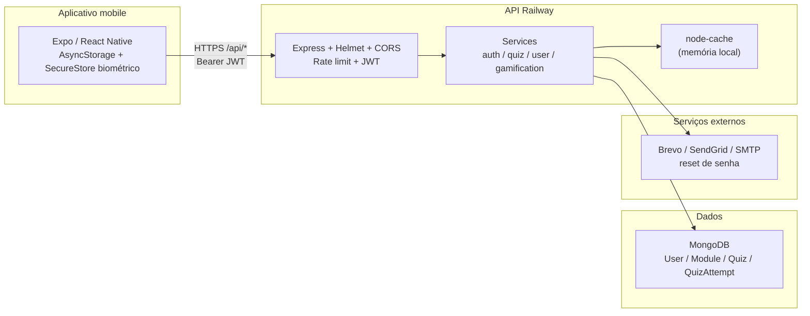

# Auditoria de Arquitetura — NoteMusic

**Data:** 2026-07-11  
**Escopo:** App Expo/React Native (`NoteMusic`) + API Express (`NoteMusic-BackEnd`)  
**Método:** Análise estática do código e configurações versionadas. Painel Railway/MongoDB Atlas não inspecionado ao vivo.

---

## 1. Resumo da arquitetura

Monólito backend Node.js/Express com MongoDB (Mongoose), cliente mobile Expo SDK 54 em teste fechado na Play Console, API em produção no Railway. Autenticação JWT stateless. E-mail via Brevo/SendGrid/SMTP. Cache in-process (`node-cache`). Sem Redis, filas, workers ou refresh tokens.



---

## 2. Tecnologias e versões

### Backend (`NoteMusic-BackEnd/package.json`)

| Tecnologia | Versão |
|------------|--------|
| Node (runtime) | Não fixado no repo — **não foi possível verificar** no Railway |
| Express | ^4.21.2 |
| Mongoose | ^8.9.5 |
| mongodb driver | ^6.18.0 |
| jsonwebtoken | ^9.0.2 |
| bcryptjs | ^2.4.3 |
| helmet | ^8.0.0 |
| cors | ^2.8.5 |
| express-rate-limit | ^7.5.1 |
| express-validator | ^7.2.1 |
| @sendgrid/mail | ^8.1.6 |
| nodemailer | ^7.0.5 |
| node-cache | ^5.1.2 |
| Jest / Supertest / mongodb-memory-server | dev |

### Frontend (`NoteMusic/package.json`)

| Tecnologia | Versão |
|------------|--------|
| Expo | ~54.0.35 |
| React Native | ^0.81.5 |
| React | 19.1.0 |
| TypeScript | ~5.9.2 |
| React Navigation | native-stack ^7.x |
| AsyncStorage | ^2.2.0 |
| expo-secure-store | ~15.0.8 |
| App version (`app.json`) | 2.1.0 / versionCode 13 |
| npm package version | 1.0.0 (desalinhado) |

---

## 3. Estrutura do front-end

```
NoteMusic/
├── app/                 App.tsx, navigation/
├── contexts/            AuthContext
├── features/            auth, modules, quiz, profile, onboarding, account
├── services/            api.ts, quiz*, module*, quizAttempt*
├── shared/              components, hooks, utils, biometric
├── __tests__/
├── android/             bare workflow / EAS
└── eas.json
```

Fluxo principal: Welcome → Login/Register → Módulos → Quiz → Gamificação/Perfil.

---

## 4. Estrutura do back-end

```
NoteMusic-BackEnd/
├── server.js            entry + listen + SIGTERM parcial
├── src/
│   ├── app.js           middlewares + rotas
│   ├── config/          database, email
│   ├── controllers/
│   ├── middlewares/     auth, cache, adminSecret, validate, errors
│   ├── models/          user, module, quiz, quizAttempt
│   ├── routes/
│   ├── services/
│   ├── validators/
│   └── tests/
├── scripts/             seed, maintenance, archive
└── docs/
```

Padrão: Routes → Controllers → Services → Models. Sem camada repository explícita.

---

## 5. Fluxo aplicativo → API → MongoDB

1. App chama `https://notemusic-backend-production.up.railway.app/api` (hardcoded em `services/api.ts`).
2. Token JWT em AsyncStorage; enviado como `Authorization: Bearer`.
3. Middleware `protect` valida JWT e carrega `User` ativo.
4. Services leem/escrevem MongoDB via Mongoose.
5. Respostas de listagem de módulos passam por `node-cache` (TTL 180–300s).
6. Reset de senha dispara e-mail (Brevo → SendGrid → SMTP).

---

## 6. Autenticação

| Aspecto | Implementação |
|---------|---------------|
| Mecanismo | JWT HS256, payload `{ id }` |
| Secret | `JWT_SECRET` |
| Expiração | `JWT_EXPIRES_IN` \|\| `7d` |
| Refresh token | **Não existe** |
| Logout | Cosmético no servidor (token permanece válido até expirar) |
| Senha | bcryptjs salt 10, `pre('save')` |
| Roles | Middleware `authorize` existe; schema User **sem** `role`; rotas não usam |

---

## 7. Recuperação de senha

1. `POST /api/auth/forgotpassword` — mensagem genérica (anti-enumeração).
2. Código 6 dígitos (`crypto.randomInt`), hash SHA-256 no User, TTL ~15 min.
3. `POST /api/auth/resetpassword` — e-mail + código + nova senha.
4. Rate limit 5/h **somente em production**.
5. Fluxo legado `changetemppassword` mantido.

---

## 8. Serviços externos

| Serviço | Uso |
|---------|-----|
| Brevo API / SMTP | E-mail de reset (preferencial) |
| SendGrid | Fallback e-mail |
| Gmail SMTP | Dev |
| MongoDB | Persistência (URI via `MONGODB_URI`) |
| Railway | Hosting API |
| Google Play | Distribuição (teste fechado) |
| EAS Build | Builds Android |

Sem storage de arquivos (S3 etc.). Sem Redis.

---

## 9. Estratégia de logs

- Backend: `console.log` / `console.error` ad hoc; logs verbosos de quiz (incluindo opções/`isCorrect` em alguns fluxos).
- Frontend: mistura de `devLog` (`__DEV__`) e `console.log` sem guard (incluindo senha no registro).
- Sem correlation/request ID.
- Sem agregador (Sentry, Logtail, etc.) no código.

---

## 10. Configuração de produção

### Variáveis (nomes apenas)

`PORT`, `NODE_ENV`, `MONGODB_URI`, `JWT_SECRET`, `JWT_EXPIRES_IN`, `CORS_ORIGINS`, `TRUST_PROXY`, `FRONTEND_URL`, `APP_NAME`, `RESET_PASSWORD_EXPIRES_MIN`, `BREVO_API_KEY`, `BREVO_SMTP_*`, `SENDGRID_API_KEY`, `EMAIL_USER`, `EMAIL_PASS`, `ADMIN_SECRET`, `CACHE_CLEAR_SECRET`, seeds `DEV_USER_*` / `MASTER_*`.

### Deploy artefatos

| Artefato | Status |
|----------|--------|
| Dockerfile | Ausente |
| railway.json / railway.toml | Ausentes |
| `.railwayignore` | Presente |
| `deploy.sh` | Presente (`npm install --production` + `npm start`) |
| Start | `npm start` → `node server.js` |
| Health | `/api/health` e `/health` (sem checagem de DB) |

---

## 11. Configuração Railway

Documentação operacional em `docs/EXECUTAR_NO_RAILWAY.md` e correlatos. Deploy típico Nixpacks.

**Não foi possível verificar pelo código:** região, plano exato, memória/CPU alocados, número de réplicas, métricas reais, healthcheck configurado no painel.

Ver seção “Informações que precisam ser verificadas no painel Railway” em `scalability-plan.md`.

---

## 12. Conexão MongoDB

```js
// src/config/database.js
mongoose.connect(process.env.MONGODB_URI || 'mongodb://localhost:27017/notemusic')
```

- Sem opções explícitas de pool (`maxPoolSize`, etc.).
- Sem handlers de reconnect customizados.
- Shutdown não fecha `mongoose.connection`.
- Fallback localhost perigoso se `MONGODB_URI` faltar em staging mal configurado.

Provedor (Atlas vs outro), tier, região e backups: **não foi possível verificar**.

---

## 13. Tarefas síncronas e assíncronas

| Tipo | Exemplos |
|------|----------|
| Síncronas na request | Auth, quizzes, gamificação, ranking, e-mail de reset (bloqueia até enviar) |
| Assíncronas / background | **Nenhuma** (sem filas/cron in-process) |
| TTL Mongo | `QuizAttempt.expiresAt` |
| Exclusão de conta | Soft-delete com data; **sem worker** que execute exclusão permanente |
| Cleanup attempts | Script/manual `POST /api/quiz-attempts/cleanup` (admin) |

---

## 14. Endpoints principais

| Prefixo | Domínio |
|---------|---------|
| `/api/health`, `/health` | Health |
| `/api/auth/*` | Login, register, reset, me, logout, delete-account |
| `/api/users/*` | Perfil, progress, ranking, notifications; `GET /basic-info` público |
| `/api/modules/*` | Catálogo (público + cache); complete (auth) |
| `/api/quiz/*` | Daily challenge (público), submit, validate, history |
| `/api/gamification/*` | Stats, achievements, leaderboard |
| `/api/quiz-attempts/*` | Tentativas (auth); cleanup/reset (admin) |
| `/api/cache/*` | Stats/clear/invalidate (admin secret) |

---

## 15. Principais fluxos do usuário

1. Cadastro / login → JWT.
2. Listar módulos → estudar → completar módulo.
3. Fazer quiz (validate por questão + submit privado).
4. Desafio diário.
5. Ver ranking / achievements.
6. Esqueci senha → código e-mail → reset.
7. Solicitar exclusão de conta (soft).

---

## 16. Pontos únicos de falha

1. **Única instância Railway** — queda = app offline.
2. **MongoDB único** — queda = API inutilizável.
3. **Cache em memória** — perdido em restart; inconsistente com N instâncias.
4. **E-mail** — falha impede reset (código limpo após falha de envio — bom), mas sem fila de retry.
5. **JWT sem revogação** — comprometimento de token dura até expirar.
6. **URL API hardcoded no app** — troca de backend exige novo build.

---

## 17. Dependências críticas

| Dependência | Impacto se falhar |
|-------------|-------------------|
| MongoDB | Total |
| Railway runtime | Total |
| `JWT_SECRET` | Auth quebrada / insegura |
| Provedor de e-mail | Só reset de senha |
| Play Console / EAS | Distribuição, não runtime API |

---

## 18. Classificação preliminar

Arquitetura **razoavelmente preparada para crescimento inicial** (dezenas a baixo centenas de usuários ativos), **não preparada** para afirmar suporte a 1.000 usuários simultâneos sem medição. Detalhes em `scalability-plan.md`.
